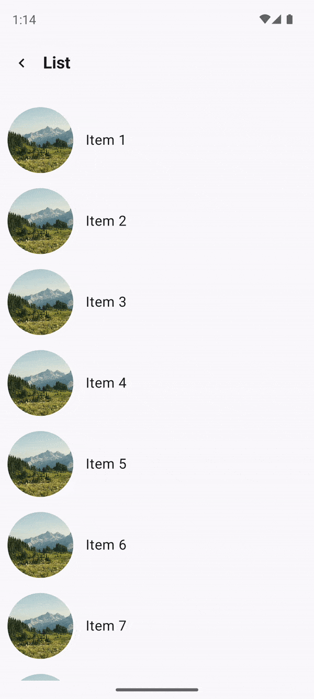
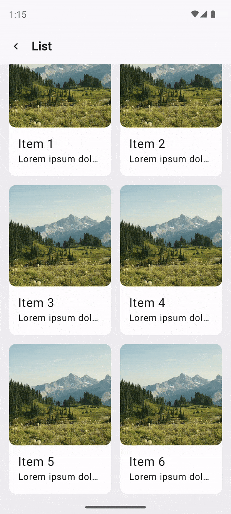
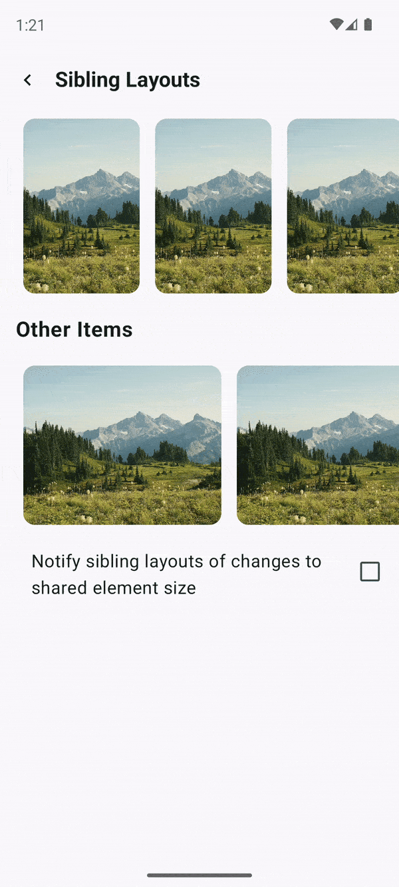
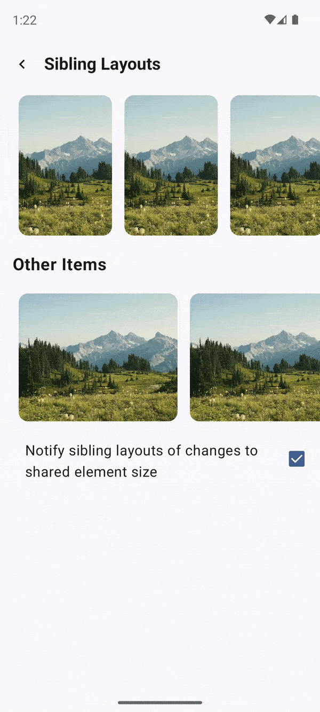
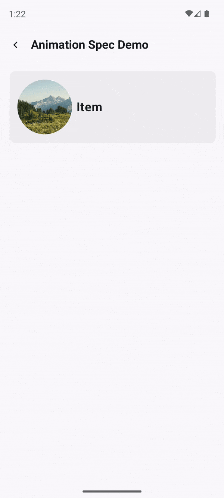
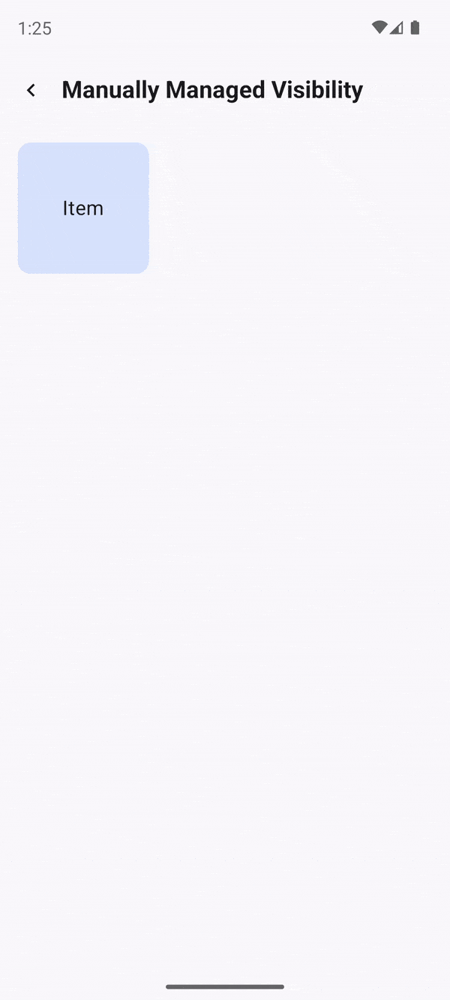
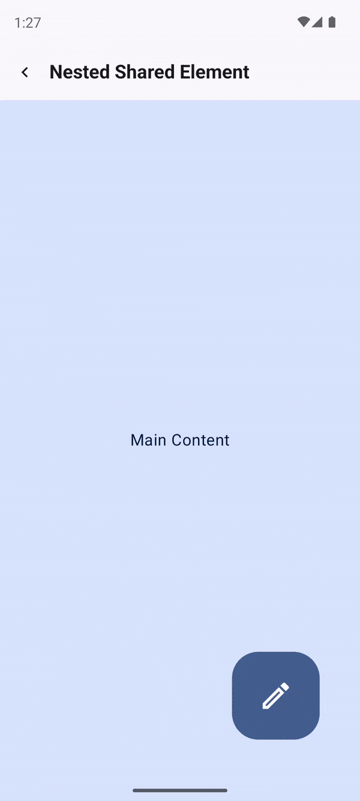

# Shared Transitions Demo

This project explores the newly introduced shared element transition features in Jetpack Compose.

**Shared element transitions** - a seamless way to transition between composables that have content that is consistent between them. They are often used for navigation, allowing you to visually connect different screens as a user navigates between them.

## Official Documentation
1. [Google Documentation](https://developer.android.com/develop/ui/compose/animation/shared-elements)
2. [Shared elements in Compose](https://www.youtube.com/watch?v=PR6rz1QUkAM&t=6s) - how it works under the hood & samples of use.

## Libraries
```kotlin
// Shared element support is available from Compose 1.7.0, and is experimental.
implementation("androidx.compose.animation:animation-android:1.7.2")
implementation("androidx.compose.animation:animation-core-android:1.7.2")

implementation("androidx.navigation:navigation-compose:2.8.1")
```

## Examples:

1. **List Details** - displays the standard transition animation from a list screen to a detail screen.



2. **List Details Cards** - demonstrates the standard transition animation from a list screen to a detail screen with a card animation using `sharedBounds()`.



3. **Sibling Layouts** - shows two variations of how an animated element interacts with its surrounding (sibling) elements: either passing its size changes to them or not.

<p float="left">
  
  
</p>

4. **Animation Spec Demo** - displays how to customize the transition animation.



5. **Manually Managed Visibility** - demonstrates how to manually control the visibility of elements during an animation when not using `animatedVisibilityScope` (e.g., `NavHost`, `AnimatedVisibility`, or `AnimatedContent`).



6. **Animated Visibility** - shows an example of how to use shared element transitions with `AnimatedVisibility`.


7. **Nested Shared Element** - demonstrates how to use nested shared elements.




## Tips
1. To implement shared element transition you need **animationVisibilityScope** to adjust which element should be visible. For this purpose you can use: `NavHost`, `AnimatedVisibility` or `AnimatedContent`(they provide their own `animationVisibilityScope`). Or you can adjust the visibility of elements [manually](https://developer.android.com/develop/ui/compose/animation/shared-elements#managing-visibility).
2. **The order of where this modifier is placed in the modifier chain is important**. Put anything you don't want to be shared **before** the `sharedElement()` in the modifier chain.
3. Use **shared elements** when the content is the same, and use **shared bounds** when the content is visually different but should share the same area between states (including font changes, image filter change etc.) [Shared bounds & shared element]("https://developer.android.com/develop/ui/compose/animation/shared-elements#shared-bounds")
4. **For bounds that are different aspect ratios**, and if you'd like fluid continuity between the two shared elements, `scaleMode = RemeasureToBounds` is recommended. For Text composables, `scaleMode = ScaleToBounds` is recommended as it'll avoid relayout and reflowing of text onto different lines. 
5. When working with complex shared elements, it is a good practice to create a key that is not a string, because strings can be error prone to match.
6. Use the same key as shared element key for `placeholderMemoryCacheKey()` and `memoryCacheKey() for Coil`s AsyncImages to have smooth effect
7. **TextAlign** changes are not animated by default. Instead use `Modifier.wrapContentSize()` / `Modifier.wrapContentWidth() over using different TextAlign for shared transitions.
8. You can use [predictive-back support]("https://developer.android.com/develop/ui/compose/animation/shared-elements/navigation#predictive-back") for shared elements.

## Current Limitations
These APIs have a few limitations. Most notably:
- No interoperability between Views and Compose is supported. This includes any composable that wraps `AndroidView`, such as a `Dialog`.
   - There is no automatic animation support for the following:
      - **Shared Image composables:**
         - `ContentScale` is not animated by default. It snaps to the set end `ContentScale`.
      - **Shape clipping** - There is no built-in support for automatic animation between shapes - for example animating from a square to a circle as the item transitions (use `clipInOverlayDuringTransition` parameter).
      - For the unsupported cases, use `Modifier.sharedBounds()` instead of `sharedElement()` and add `Modifier.animateEnterExit()` onto the items.

## Other Samples
https://developer.android.com/develop/ui/compose/animation/shared-elements/additional-samples
